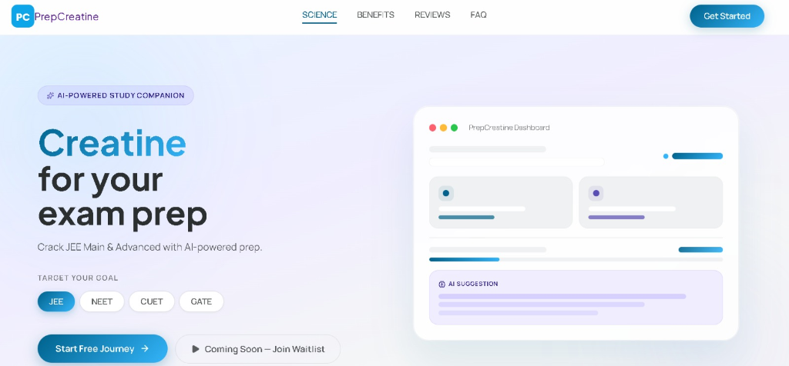
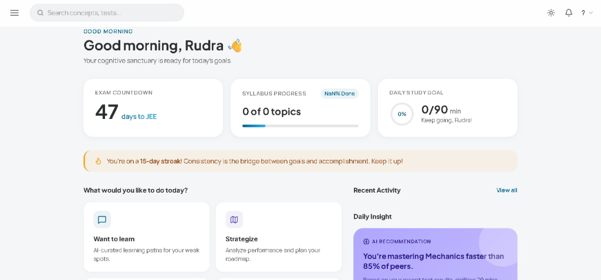
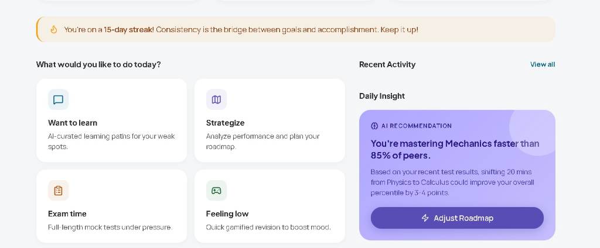
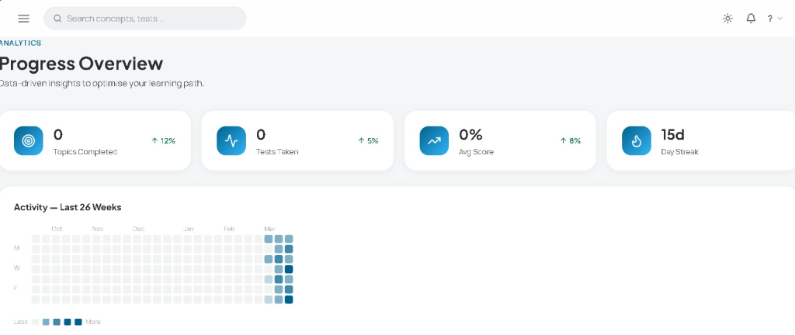
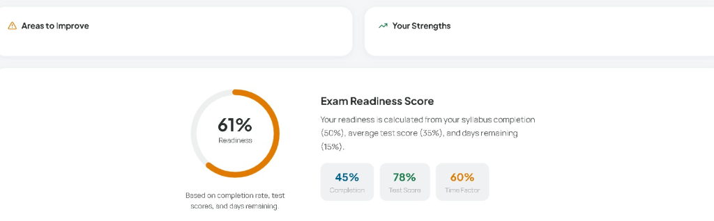

<div align="center">
  
  <h1>PrepCreatine</h1>
  <p>Your AI-Powered Cognitive Sanctuary for Exam Preparation</p>

  
</div>

Welcome to **PrepCreatine**, an intelligent personalized study platform designed to help students crack rigorous exams like JEE, NEET, CUET, and GATE using state-of-the-art AI generation, RAG-based knowledge retrieval, and autonomous LangGraph agents.

## 📸 Platform Screenshots

### Smart Dashboard & Daily Activity



### Comprehensive Analytics & Readiness



*(Note: Please ensure you place the screenshots provided into the `docs/images/` directory matching the filenames above to render them!)*

---

## 🚀 Setup Instructions (Step by Step)

PrepCreatine consists of three main components:
1. **Java Spring Boot Backend** (Core API, Authentication, AI Integration)
2. **Next.js React Frontend** (Student Facing UI)
3. **Python LangGraph Planner** (Autonomous Background Agent)

### Prerequisites
- **Java 21+** (for Spring Boot Backend)
- **Node.js 18+ & npm** (for Next.js Frontend)
- **Python 3.10+** (for Planner Agent)
- **PostgreSQL 15+** (Running locally on port 5432)

---

### Step 1: Database Setup
1. Start your PostgreSQL server.
2. Create a database named `prepcreatine`.
   ```sql
   CREATE DATABASE prepcreatine;
   ```
3. Update the credentials in `/.env` (copy `.env.example` to `.env` if you haven't already):
   ```env
   DATABASE_URL=jdbc:postgresql://localhost:5432/prepcreatine
   DB_USERNAME=postgres
   DB_PASSWORD=yourpassword
   JWT_SECRET=your_very_secure_jwt_secret_key_that_is_long_enough
   ```

### Step 2: Running the Java Spring Boot Backend
1. Open a terminal in the root directory.
2. Ensure `GROQ_API_KEY` or `GEMINI_API_KEY` is set in your environment if you want to use the AI capabilities.
3. If you want to run the app using the one-click Demo Auth bypass, enable demo mode:
   - **Windows:** `$env:DEMO_MODE="true"`
   - **Mac/Linux:** `export DEMO_MODE=true`
4. Start the backend application using the Maven wrapper:
   ```bash
   ./mvnw spring-boot:run
   ```
   *The backend will boot up, run automated self-tests, seed the NCERT corpus, and start the server on `http://localhost:8080`.*

### Step 3: Running the Python Autonomous Planner Agent
The Planner orchestrates daily study plans and adapts them based on your struggles.
1. Open a new terminal and navigate to the `planneragent` directory:
   ```bash
   cd planneragent
   ```
2. Create and activate a Virtual Environment (Optional but recommended):
   ```bash
   python -m venv venv
   source venv/bin/activate  # On Windows use: venv\Scripts\activate
   ```
3. Install the required dependencies:
   ```bash
   pip install -r requirements.txt
   ```
4. Set your API key for the agent (e.g., `GROQ_API_KEY`):
   ```bash
   export GROQ_API_KEY="your-groq-api-key"
   ```
5. Start the LangGraph FastAPI server:
   ```bash
   python graph.py
   ```
   *The planner agent will spin up and listen on `http://localhost:8001`.*

### Step 4: Running the Next.js Frontend
PrepCreatine has a primary modern frontend interface (`frontend`) which is fully integrated with the backend APIs.
1. Open a new terminal and navigate to the `frontend` directory:
   ```bash
   cd frontend
   ```
2. Install the necessary NPM dependencies:
   ```bash
   npm install
   ```
3. Create a `.env.local` file inside the `frontend` folder with the backend API URL:
   ```env
   NEXT_PUBLIC_API_URL=http://localhost:8080/api
   ```
4. Start the development server:
   ```bash
   npm run dev
   ```
5. Open your browser and navigate to `http://localhost:3000`. If you started the backend with `DEMO_MODE=true`, you can simply click "Login as Demo User" on the login screen to bypass authentication!

---

## 📂 Project Structure Overview
- `/src` — The core Spring Boot API backend containing models, repositories, and controllers.
- `/frontend` — The primary Next.js web application for students.
- `/frontend2` — An alternative/experimental frontend UI application.
- `/planneragent` — The Python-based LangGraph intelligent agent for dynamic study planning.

Enjoy building your AI-driven cognitive sanctuary!
